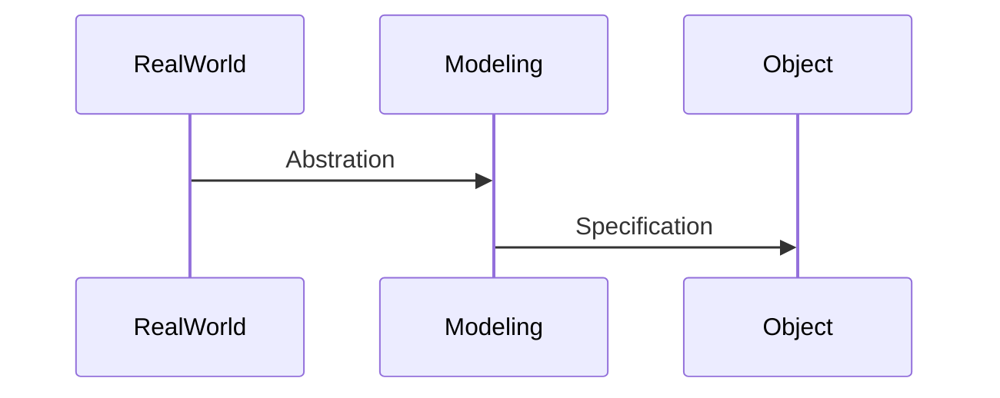

# OOP in ABAP.

Object-Oriented Programming에 대한 개념.
**객체 지향 언어 VS 절차 지향 언어**
|Object Oriented Programming  | Procedure Programming |
|--|--|
|직관적이 않고 복잡하다  | 직관적이고 간단하다 |
| 코딩 수 감소 | 코딩 수 증가 |
| 인스턴스 생성 가능 | 인스턴스 생성 불가 |
| 유지보수 편리하다 | 유지보수 불편 |
| 복잡한 프로그램에서 용이 | 간단한 프로그램에서 적용 용이 |

# 주요 concept.

 1. Class : Method들을 모아 놓은 것.
 2. 인스턴스 :  Class의 객체
 - ex) 클래스 : 김밥 레시피 // 인스턴스 : 참치 김밥, 김치 김밥, 소고기 김밥
 3. Method : 클래스의 실제 기능이 저장된 곳.
 4. 접근자 : 클래스들에 대해 접근 설정.(접근을 허용하는 범위)
 
|PROTECTED|PRIVATE|PUBLIC|
|----------------|---|---|
|자식클래스에서만 접근 가능|클래스 외부에서 접근 불가|외부에서 접근 모두 허용|

 4. 추상화 : 실제 존재하는 객체를 모델(attribute + Method)화함. 
 5. 추상클래스 : 선언부만 되어있고, 메서드들의 상세 정의는  자식클래스에서 함.
 6. 오버라이드 : 하위 클래스에서 메소드를 다시 정의하여 사용하는 것.
- Ex) 옵티머스 프라임(상위 클래스), 옵티머스 프라임 + 날개(하위 클래스) : 확장.
- Ex) 옵티머스 프라임(상위 클래스), 옵티머스 프라임 트레일러 모드(하위클래스) : 변형.
 7. 오버로딩 :  하위 클래스 단에서, Parameter 개수, 타입 등에 의해서 이름은 같은데 기능은 달라지는 것. 
- Ex) 카멜레온(오버로딩해주는 메서드)이 주변환경(파라미터 개수, 타입 등등)에 따라 녹색이 될수도 있고, 갈색이 될 수 도 있다.)
8. 상속(Inheritance) : 공통적인 부분(부모)들을 공유(일반화)하여, 자식클래스들을 특징있게(특수화) 정의하면 편리하게 코딩이 가능.
9.  CASTING :  타입이 완전하게 동일하지 않더라도 형변환을 시켜줌.
#####                - 상속관계간의 CASTING.
| UP | DOWN|
|--|--|
| 부모가 자식의 형태로 변환되는 것 | 자식이 부모의 형태로 변환되는 것 |
   
    
데이터 객체화 Diagram



상속 Diagram

```jsseq
graph LR
A[부모클래스 A] -- 상속 --> B[자식클래스 A + B]
A -- 상속 --> C[자식클래스 A + C]
```
